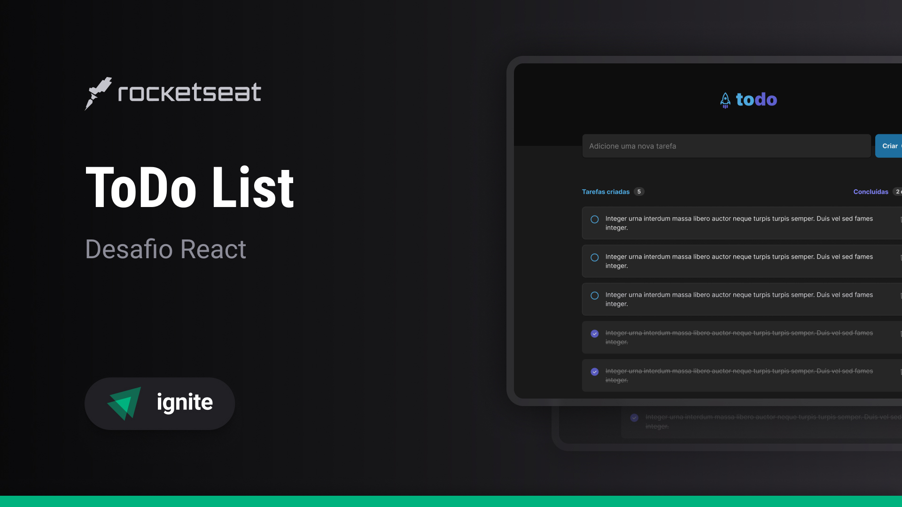

# Desafio 01 - Praticando os conceitos do ReactJS

## **Desafio 01 da trilha Ignite da Rocketseat**

<!-- Divider -->

### :writing_hand: Author:

- Nicolas Loffi Kaminski

### :rocket: Technologies:

1. HTML
2. Css
   - Tailwind
3. JavaScript
4. React
5. Typescript
6. Git e GitHub

### :art: Project:

- O projeto **Desafio 01 - Praticando os conceitos do ReactJS** exemplifica uma lista de coisas a fazer **(ToDo List)**.

- Caso queria adquirir o projeto, _clone o repositorio_ para algum lugar do seu computador de sua preferencia ou faça o _Download ZIP_ do projeto.

- Depois de clonado abra o projeto e execute no terminal o seguinte código para instalar as dependências: `npm install`

- Para rodar execute o seguinte comando no terminal: `npm run dev`
